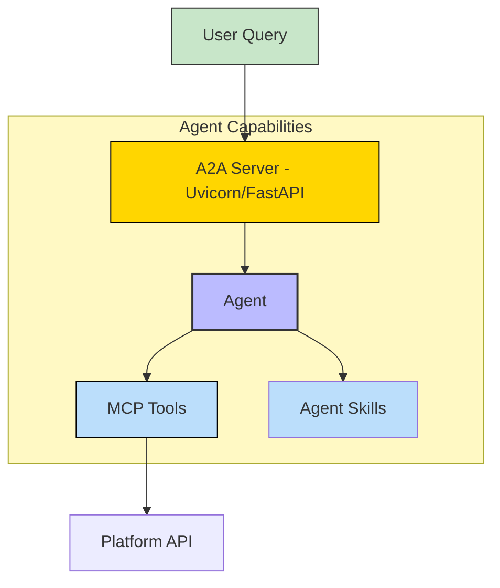
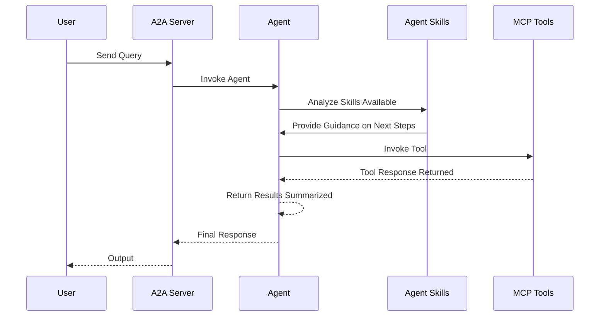

# Systems-Manager - A2A | AG-UI | MCP


*Version: 1.1.25*

## Overview

Systems-Manager is a powerful CLI and MCP server tool to manage your system across multiple operating systems. It supports updating, installing, and optimizing applications, managing Windows features, installing Nerd Fonts, and retrieving system and hardware statistics. It now supports Ubuntu, Debian, Red Hat, Oracle Linux, SLES, Arch, and Windows, with Snap fallback for Linux application installations.

This repository is actively maintained - Contributions are welcome!

### Features

- **Multi-OS Support**: Works on Windows, Ubuntu, Debian, Red Hat, Oracle Linux, SLES, and Arch.
- **Application Management**: Install and update applications using native package managers (apt, dnf, zypper, pacman, winget) with automatic Snap fallback for Linux.
- **Font Installation**: Install specific Nerd Fonts (default: Hack) or all available fonts from the latest release.
- **Windows Feature Management**: List, enable, or disable Windows optional features (Windows only).
- **System Optimization**: Clean and optimize system resources (e.g., trash/recycle bin, autoremove, defragmentation on Windows).
- **System and Hardware Stats**: Retrieve detailed OS and hardware information using `psutil`.
- **Logging**: Optional logging to a specified file or default `systems_manager.log` in the script directory.
- **FastMCP Server**: Expose all functionality via a Model Context Protocol (MCP) server over stdio or HTTP for integration with AI or automation systems.

## MCP

### MCP tools:
- `install_applications`: Install applications with Snap fallback (Linux).
- `update`: Update system and applications.
- `clean`: Clean system resources (e.g., trash/recycle bin).
- `optimize`: Optimize system (e.g., autoremove, defrag on Windows).
- `install_python_modules`: Install Python modules via pip.
- `install_fonts`: Install specified Nerd Fonts (default: Hack) or all fonts.
- `get_os_stats`: Retrieve OS statistics.
- `get_hardware_stats`: Retrieve hardware statistics.
- `list_windows_features`: List Windows features (Windows only).
- `enable_windows_features`: Enable Windows features (Windows only).
- `disable_windows_features`: Disable Windows features (Windows only).
- `run_command`: Run elevated commands on shell (Enable at your own risk).

## A2A Agent

### Architecture:



### Component Interaction Diagram



## Usage

### CLI

| Short Flag | Long Flag           | Description                                              |
|------------|---------------------|----------------------------------------------------------|
| -h         | --help              | See usage for script                                     |
| -c         | --clean             | Clean Recycle/Trash bin                                  |
| -e         | --enable-features   | Enable Windows features (comma-separated, Windows only)   |
| -d         | --disable-features  | Disable Windows features (comma-separated, Windows only)  |
| -l         | --list-features     | List all Windows features and their status (Windows only) |
| -f         | --fonts             | Install Nerd Fonts (comma-separated, e.g., Hack,Meslo or 'all'; default: Hack) |
| -i         | --install           | Install applications (comma-separated, e.g., python3,git) |
| -p         | --python            | Install Python modules (comma-separated)                  |
| -s         | --silent            | Suppress output to stdout                                 |
| -u         | --update            | Update applications and Operating System                 |
| -o         | --optimize          | Optimize system (e.g., autoremove, clean cache, defrag)   |
|            | --os-stats          | Print OS statistics (e.g., system, release, version)      |
|            | --hw-stats          | Print hardware statistics (e.g., CPU, memory, disk)       |
|            | --log-file          | Log to specified file (default: systems_manager.log)      |

```bash
systems-manager --fonts Hack,Meslo --update --clean --python geniusbot --install python3,git --enable-features Microsoft-Hyper-V-All,Containers --log-file /path/to/log.log
```

### MCP CLI

| Short Flag | Long Flag                          | Description                                                                 |
|------------|------------------------------------|-----------------------------------------------------------------------------|
| --mcp-url        | MCP Server URL to connect to                     | http://systems-manager-mcp.arpa/mcp |
| --allowed-tools  | List of allowed MCP tools                        | system_management            |
| --web            | Enable Pydantic AI Web UI                        | False (Env: ENABLE_WEB_UI)  |
| -t         | --transport                        | Transport method: 'stdio', 'http', or 'sse' [legacy] (default: stdio)       |
| -s         | --host                             | Host address for HTTP transport (default: 0.0.0.0)                          |
| -p         | --port                             | Port number for HTTP transport (default: 8000)                              |
|            | --auth-type                        | Authentication type: 'none', 'static', 'jwt', 'oauth-proxy', 'oidc-proxy', 'remote-oauth' (default: none) |
|            | --token-jwks-uri                   | JWKS URI for JWT verification                                              |
|            | --token-issuer                     | Issuer for JWT verification                                                |
|            | --token-audience                   | Audience for JWT verification                                              |
|            | --oauth-upstream-auth-endpoint     | Upstream authorization endpoint for OAuth Proxy                             |
|            | --oauth-upstream-token-endpoint    | Upstream token endpoint for OAuth Proxy                                    |
|            | --oauth-upstream-client-id         | Upstream client ID for OAuth Proxy                                         |
|            | --oauth-upstream-client-secret     | Upstream client secret for OAuth Proxy                                     |
|            | --oauth-base-url                   | Base URL for OAuth Proxy                                                   |
|            | --oidc-config-url                  | OIDC configuration URL                                                     |
|            | --oidc-client-id                   | OIDC client ID                                                             |
|            | --oidc-client-secret               | OIDC client secret                                                         |
|            | --oidc-base-url                    | Base URL for OIDC Proxy                                                    |
|            | --remote-auth-servers              | Comma-separated list of authorization servers for Remote OAuth             |
|            | --remote-base-url                  | Base URL for Remote OAuth                                                  |
|            | --allowed-client-redirect-uris     | Comma-separated list of allowed client redirect URIs                       |
|            | --eunomia-type                     | Eunomia authorization type: 'none', 'embedded', 'remote' (default: none)   |
|            | --eunomia-policy-file              | Policy file for embedded Eunomia (default: mcp_policies.json)              |
|            | --eunomia-remote-url               | URL for remote Eunomia server                                              |

### Using as an MCP Server

The MCP Server can be run in two modes: `stdio` (for local testing) or `http` (for networked access). To start the server, use the following commands:

#### Run in stdio mode (default):
```bash
systems-manager-mcp --transport "stdio"
```

#### Run in HTTP mode:
```bash
systems-manager-mcp --transport "http"  --host "0.0.0.0"  --port "8000"
```


### Dependencies

The following Python packages are automatically installed if missing:
- `distro`: For Linux distribution detection.
- `psutil`: For system and hardware statistics.
- `requests`: For downloading Nerd Fonts.
- `fastmcp`: For MCP server functionality (required for `systems-manager-mcp`).

### Agent-to-Agent (A2A) Server

This package includes an Agent utilizing `pydantic-ai` that can be deployed as an A2A server.

#### Endpoints
- **Web UI**: `http://localhost:8000/` (if enabled)
- **A2A**: `http://localhost:8000/a2a` (Discovery: `/a2a/.well-known/agent.json`)
- **AG-UI**: `http://localhost:8000/ag-ui` (POST)

#### A2A CLI

| Long Flag        | Description                                      | Default                     |
|------------------|--------------------------------------------------|-----------------------------|
| --host           | Host to bind the server to                       | 0.0.0.0                     |
| --port           | Port to bind the server to                       | 9000                        |
| --reload         | Enable auto-reload                               | False                       |
| --provider       | LLM Provider (openai, anthropic, google, etc)    | openai                      |
| --model-id       | LLM Model ID                                     | qwen/qwen3-4b-2507               |
| --base-url       | LLM Base URL (for OpenAI compatible providers)   | http://host.docker.internal:1234/v1    |
| --api-key        | LLM API Key                                      | ollama                      |
| --mcp-url        | MCP Server URL to connect to                     | None                        |
| --mcp-config     | MCP Server Config                                | ...                         |
| --skills-directory| Directory containing agent skills               | ...                         |
| --web            | Enable Pydantic AI Web UI                        | False (Env: ENABLE_WEB_UI)  |

#### Run A2A Server

```bash
systems-manager-agent --provider openai --model-id qwen/qwen3-4b-2507
```

### Deploy MCP Server as a Service

The MCP server can be deployed using Docker, with configurable authentication, middleware, and Eunomia authorization.

#### Using Docker Run

```bash
docker pull knucklessg1/systems-manager:latest

docker run -d \
  --name systems-manager-mcp \
  -p 8004:8004 \
  -e HOST=0.0.0.0 \
  -e PORT=8004 \
  -e TRANSPORT=http \
  -e AUTH_TYPE=none \
  -e EUNOMIA_TYPE=none \
  knucklessg1/systems-manager:latest
```

For advanced authentication (e.g., JWT, OAuth Proxy, OIDC Proxy, Remote OAuth) or Eunomia, add the relevant environment variables:

```bash
docker run -d \
  --name systems-manager-mcp \
  -p 8004:8004 \
  -e HOST=0.0.0.0 \
  -e PORT=8004 \
  -e TRANSPORT=http \
  -e AUTH_TYPE=oidc-proxy \
  -e OIDC_CONFIG_URL=https://provider.com/.well-known/openid-configuration \
  -e OIDC_CLIENT_ID=your-client-id \
  -e OIDC_CLIENT_SECRET=your-client-secret \
  -e OIDC_BASE_URL=https://your-server.com \
  -e ALLOWED_CLIENT_REDIRECT_URIS=http://localhost:*,https://*.example.com/* \
  -e EUNOMIA_TYPE=embedded \
  -e EUNOMIA_POLICY_FILE=/app/mcp_policies.json \
  knucklessg1/systems-manager:latest
```

#### Using Docker Compose

Create a `docker-compose.yml` file:

```yaml
services:
  systems-manager-mcp:
    image: knucklessg1/systems-manager:latest
    environment:
      - HOST=0.0.0.0
      - PORT=8004
      - TRANSPORT=http
      - AUTH_TYPE=none
      - EUNOMIA_TYPE=none
    ports:
      - 8004:8004
```

For advanced setups with authentication and Eunomia:

```yaml
services:
  systems-manager-mcp:
    image: knucklessg1/systems-manager:latest
    environment:
      - HOST=0.0.0.0
      - PORT=8004
      - TRANSPORT=http
      - AUTH_TYPE=oidc-proxy
      - OIDC_CONFIG_URL=https://provider.com/.well-known/openid-configuration
      - OIDC_CLIENT_ID=your-client-id
      - OIDC_CLIENT_SECRET=your-client-secret
      - OIDC_BASE_URL=https://your-server.com
      - ALLOWED_CLIENT_REDIRECT_URIS=http://localhost:*,https://*.example.com/*
      - EUNOMIA_TYPE=embedded
      - EUNOMIA_POLICY_FILE=/app/mcp_policies.json
    ports:
      - 8004:8004
    volumes:
      - ./mcp_policies.json:/app/mcp_policies.json
```

Run the service:

```bash
docker-compose up -d
```

#### Configure `mcp.json` for AI Integration

```json
{
  "mcpServers": {
    "systems_manager": {
      "command": "uv",
      "args": [
        "run",
        "--with",
        "systems-manager",
        "systems-manager-mcp"
      ],
      "env": {
        "SYSTEMS_MANAGER_SILENT": "False",
        "SYSTEMS_MANAGER_LOG_FILE": "~/Documents/systems_manager_mcp.log"
      },
      "timeout": 200000
    }
  }
}

```

## Install Python Package

```bash
python -m pip install systems-manager
```

or

```bash
uv pip install --upgrade systems-manager
```

## Repository Owners


