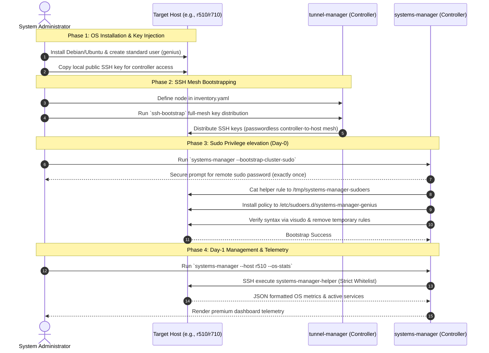

# Day-0 Host Provisioning & Infrastructure Lifecycle Sequence

Day-0 provisioning establishes the foundational, zero-trust infrastructure layer required to orchestrate containerized workloads, DNS setups, and remote service monitoring across a distributed homelab or enterprise cluster.

This guide details the exact step-by-step sequence to bring a brand-new host from bare-metal or generic VM installation to a fully-managed cluster node, integrated with `systems-manager` and the `agent-utilities` ecosystem.

---

## 1. The Day-0 Provisioning Lifecycle

The baseline setup follows a strict, sequential pipeline where each phase establishes the prerequisites for the next. This ensures secure, zero-friction operation.



---

## 2. Detailed Step-by-Step Provisioning Guide

### Step 1: Base Operating System Installation
1. Install a minimal **Debian 12** or **Ubuntu 22.04 LTS** server on the target node.
2. Configure a static IP address or static DHCP reservation (e.g. `r510.local` at `192.168.1.150`).
3. Ensure the standard user `genius` is created and has standard administrative privileges (`sudo` group).
4. Inject your controller's public SSH key into `/home/genius/.ssh/authorized_keys` so the controller has basic non-interactive key-based access to the standard user account.

---

### Step 2: Establish the SSH Key Mesh
We leverage the **`ssh-bootstrap`** skill (backed by `tunnel-manager`) to create passwordless mesh access across our host group:

1. Add the new host to the inventory config file at `~/.config/agent-utilities/inventory.yaml`:
   ```yaml
   hosts:
     r510:
       hostname: 192.168.1.150
       user: genius
       port: 22
       key_path: ~/.ssh/id_ed25519
   ```
2. Run the SSH bootstrap utility to distribute keys and mesh connection profiles:
   ```bash
   # Executes a full mesh bootstrap across the inventory group
   ssh-bootstrap --bootstrap-keys
   ```
3. Test standard passwordless connectivity:
   ```bash
   ssh -o BatchMode=yes genius@192.168.1.150 "echo connection active"
   ```

---

### Step 3: Configure Network DNS Baselines
Ensure all cluster hosts point to your designated resilient DNS resolvers (such as AdGuard Home or Technitium servers configured with high-availability rewrites).
* Update target resolver configurations under `/etc/resolv.conf` or netplan configs to route queries through your primary DNS cluster IPs.

---

### Step 4: Multi-Host Sudoers Bootstrapping (The Security Enabler)
With basic SSH keys distributed, the non-privileged standard user can log in passwordless, but cannot perform package updates or manage critical Docker/Nginx services without interactive password entry.

To resolve this securely and scale across all cluster nodes, execute the automated cluster bootstrapping command:

```bash
systems-manager --bootstrap-cluster-sudo
```

#### What Happens Under the Hood:
1. **Inventory Introspection**: Reads the configuration from `~/.config/agent-utilities/inventory.yaml`.
2. **Reachability Check**: Performs a fast SSH pre-flight check using `-o ConnectTimeout=3` and `-o BatchMode=yes` to instantly skip offline nodes without hanging.
3. **Active Verification**: Checks if passwordless sudo for the helper is already active via `sudo -n true`.
4. **Single secure input**: Prompts the operator *exactly once* for the sudo password using secure stdin masking.
5. **Secure Rule Writing**: Pipes the highly-restricted NOPASSWD helper rule (`genius ALL=(ALL) NOPASSWD: /usr/local/bin/systems-manager-helper, /home/genius/.local/bin/systems-manager-helper`) to `/tmp/systems-manager-sudoers` via `cat` over standard SSH.
6. **Atomic Verification transaction**:
   - Sudo copies the temp file to `/etc/sudoers.d/systems-manager-genius`.
   - Modifies file ownership to `root:root` and permissions to `0440`.
   - Executes `visudo -c -f /etc/sudoers.d/systems-manager-genius`.
   - If syntax is invalid, atomically deletes the file and exits `1` to prevent lockout.
7. **Cleanup**: Automatically purges `/tmp/systems-manager-sudoers` under all outcome branches.

---

## 3. Post-Provisioning Verification & Day-1 Operations

Once Day-0 bootstrapping completes successfully, the controller gains zero-friction, secure, whitelisted remote control of standard systems operations across the entire cluster.

### A. Run Remote Telemetry Queries
To verify that the wrapper is operational and can retrieve system diagnostics passwordless, query remote system telemetry from the controller:

```bash
# Query remote OS metrics on host r510
systems-manager --host r510 --os-stats

# Query remote hardware diagnostics on host r710
systems-manager --host r710 --hw-stats
```

### B. Whitelisted Remote Package Operations
Perform remote whitelisted package tasks cleanly:

```bash
# Run a secure apt-get update on a remote cluster node
systems-manager --host r510 --update
```

### C. Whitelisted Remote Service Actions
Verify that you can query whitelisted service states (such as SSH, Docker, Fail2ban, Nginx, or Caddy) over the network:

* Standard non-privileged command:
  ```bash
  ssh -o BatchMode=yes genius@192.168.1.150 "systems-manager-helper service status ssh"
  ```
* Expected secure JSON response:
  ```json
  {
    "success": true,
    "returncode": 0,
    "stdout": "● ssh.service - OpenBSD Secure Shell server\n   Loaded: loaded (/lib/systemd/system/ssh.service; enabled; vendor preset: enabled)\n   Active: active (running) since Tue 2026-05-26 08:30:15 UTC; 6h ago\n...",
    "stderr": ""
  }
  ```

---

## 4. Troubleshooting the Sequence

| Issue | Probable Cause | Resolution |
| :--- | :--- | :--- |
| **`Host is unreachable. Skipping.`** | Target host is offline, firewall is blocking port 22, or standard public SSH key was not copied during base install. | Ensure host is powered on, verify local SSH access via `ssh genius@<ip>`, and verify keys. |
| **`Failed to write temp sudoers file`** | Remote user session lacks permissions to write to `/tmp` or disk space is exhausted. | Verify disk space with `df -h` and ensure temporary write folders are write-enabled (`chmod 1777 /tmp`). |
| **`Failed to configure sudo`** | The provided password was incorrect, or the user is not a member of the remote host's `sudo` group. | Double-check credentials and ensure the standard user `genius` has sudo group access by running `groups` on the remote host. |
| **`visudo check failed`** | The path to the `systems-manager-helper` was formatted incorrectly or contains unsupported characters. | Verify that helper paths exist on the remote host (`which systems-manager-helper`). The system automatically checks standard locations. |
