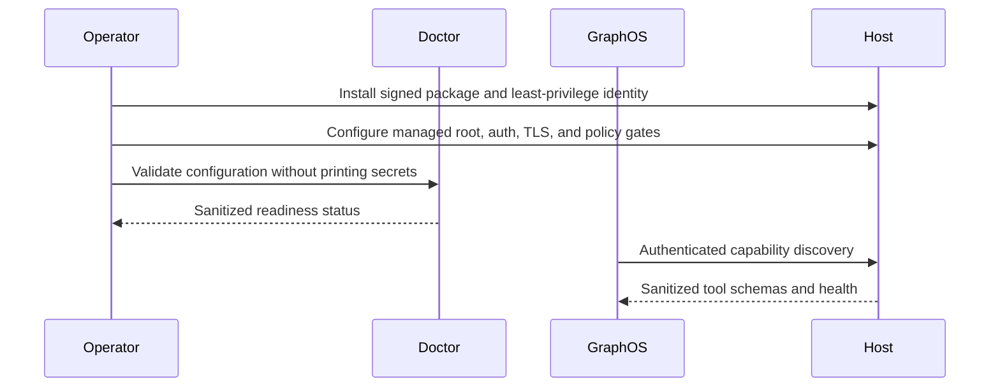

# Day-0 provisioning

Day-0 provisioning establishes the security boundary before any host mutation is
enabled. This package does not ship an environment profile, fleet inventory,
credential, host key, endpoint, username, or sudoers rule.

## Required outcomes

1. Install the signed package on the target host under a dedicated,
   least-privilege service identity.
2. Configure an absolute managed filesystem root owned by that identity and not
   writable by a group or other users.
3. Keep host mutation, filesystem mutation, sensitive-read, and network-probe
   gates disabled.
4. Configure stdio locally, or authenticated TLS for every network listener.
5. Configure verified certificate trust through an AgentConfig TLS profile when the
   deployment uses a private CA.
6. Configure observability to capture metadata only and verify that trace
   redaction is active.
7. If elevation is required, provision it outside the agent through a reviewed
   service account or a narrowly scoped helper policy.
8. Run the ecosystem doctor and capability/schema validation before exposing the
   service to GraphOS.

## Elevation helper

The optional `systems-manager-helper` accepts only typed service and package
operations. It has no built-in service or package allowlist. Deployment must set
JSON arrays through:

- `SYSTEMS_MANAGER_HELPER_ALLOWED_SERVICES_JSON`
- `SYSTEMS_MANAGER_HELPER_ALLOWED_PACKAGES_JSON`

Provision a sudoers rule only for the resolved, root-owned helper executable and
only after reviewing the generated deployment artifact. Never grant an
interpreter, shell, wildcard path, package-manager binary, or the systems-manager
process blanket passwordless sudo. Do not pass an elevation password through MCP,
CLI arguments, environment, logs, or traces.

## Fleet provisioning

Use GraphOS to delegate to an authenticated systems-manager service on each host,
or use tunnel-manager's governed fleet workflows. Tunnel configuration must use
verified host keys and secret references. There is no accept-unknown host-key mode
and no plaintext inventory password.

## Acceptance checks

- The package version, ontology, source preset, mapping, skill schema, and MCP tool
  schemas agree; any release attestations were produced by the release system.
- A non-loopback MCP or agent listener refuses to start without authentication
  and a verified TLS boundary.
- The helper refuses every service or package absent from its deployment
  allowlist.
- Sensitive reads and mutations fail while their gates are disabled.
- One approved typed mutation succeeds and is verified by a separate read.
- Traces contain opaque run/tenant references and status only—no prompt, tool
  body, command output, hostname, username, path, or credential.
- Rollback and recovery ownership are documented before autonomous maintenance is
  enabled.

See [Configuration](configuration.md), [Sudo security](sudo_security.md), and
[Host lifecycle coverage](host-lifecycle-coverage.md).
