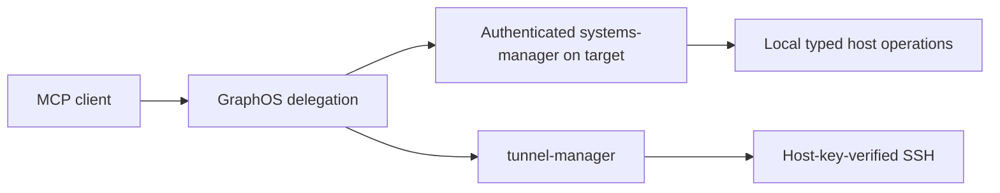

# Multi-host orchestration

`systems-manager` intentionally does not build SSH command strings or disable host-key
verification. Its typed host operations execute on the host where the process runs.
This keeps operating-system detection, executable trust, elevation, filesystem
confinement, and process-tree termination inside one local security boundary.

## Fleet pattern

Use GraphOS delegation to compose the ecosystem services:

Choose one of two reviewed deployment patterns:

1. Run an authenticated `systems-manager` service on each managed host and delegate
   to that service through GraphOS.
2. Use `tunnel-manager` for its governed, host-key-verified remote capabilities.
   Do not translate arbitrary model text into a remote shell command.

The inventory, credentials, verified `known_hosts` file, proxy policy, and endpoints
are deployment configuration. They are not packaged in this repository. Inventory
aliases should be opaque and non-personal.

## Security requirements

- Require verified SSH host keys; host-key verification cannot be disabled and
  trust-on-first-use is not accepted.
- Resolve credentials through configured secret references or SSH agent identity.
  Never pass a password or private key through a tool argument.
- Keep systems-manager host mutations default-deny and require request approval.
- Keep remote transport authentication and TLS verification enabled.
- Return opaque host references in evidence and traces; do not persist hostnames,
  usernames, local paths, commands, or command output.
- Bound connection time, operation time, output size, concurrency, and retries.

## Delegation workflow

1. Discover the target service or governed tunnel capability through GraphOS.
2. Confirm the target by opaque inventory alias without logging its connection data.
3. Run read-only discovery under the sensitive-read gate.
4. For a mutation, obtain the deployment-policy gate and request-channel approval.
5. Execute the typed operation locally on the target security boundary.
6. Verify through a separate read and record only sanitized status evidence.

The MCP tools in this package expose no remote-host selector. Remote behavior
remains explicit at the delegation layer.
