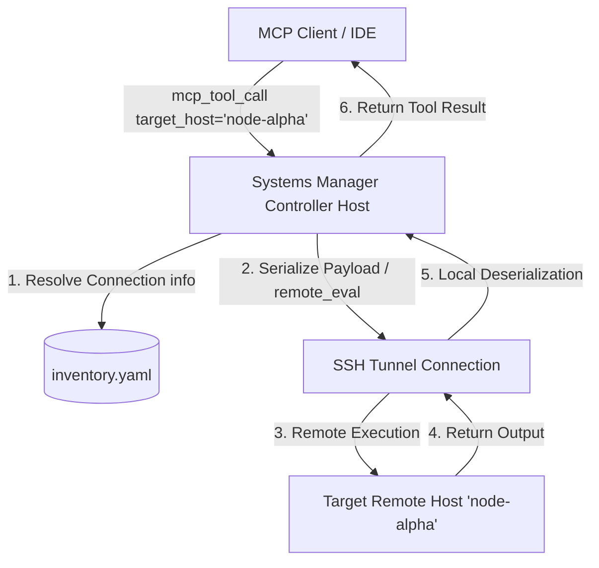

# Multi-Host Remote Orchestration Architecture

This document describes the design, configuration, and execution lifecycle of the **Zero-Script Multi-Host Telemetry and Control Plane** within `systems-manager`.

---

## 1. Architectural Overview

Historically, executing systems operations (such as updates, service control, package tracking, or filesystem actions) on remote target hosts required deploying a standalone systems manager daemon or MCP instance on every single machine. This introduced massive operational complexity, security policy fragmentation, and tool sprawl.

`systems-manager` resolves this with a **Centralized Controller** pattern utilizing **Zero-Script SSH Tunneling and Python Serialization**:



### Pre-bound Virtual Host Namespacing (Multiplexer Integration)

To optimize the developer and AI agent experience in IDEs (like Antigravity), we avoid requiring the AI agent to remember to supply `target_host` explicitly on every call. Instead, the `mcp-multiplexer` reads `inventory.yaml` and exposes host-specific **pre-bound virtual sub-servers** using namespaced prefixes (e.g. `sys_r510__run_command`).

```mermaid
graph TD
    subgraph Client / IDE Layer
        A[MCP Client or IDE] -->|Interact with| B[Unified mcp-multiplexer]
        B -->|Dynamically parses| C[(inventory.yaml)]
        B -->|Generates namespaced virtual servers| D["sys_&lt;host&gt;__ (Virtual Subprocess)"]
    end

    subgraph Centralized Controller Layer (Zero Remote Daemons)
        D -->|Prefills Target Host Env| E[Centralized Systems Manager Instance]
        E -->|Executes remote_eval over SSH| F[Remote Target Host: &lt;host&gt;]
        F -->|Runs inline standard library| G[Python 3 Inline Runtime]
    end

    style D fill:#f9f,stroke:#333,stroke-width:2px
    style E fill:#bbf,stroke:#333,stroke-width:2px
    style G fill:#bfb,stroke:#333,stroke-width:2px
```

This virtual namespacing maintains a single centralized executable on the controller host with zero remote daemons.

### Key Design Pillars:
- **Zero Remote Dependencies**: Remote target hosts require *only* standard SSH access and a basic Python interpreter installed. No systems-manager daemons, systemd services, or configuration files are deployed on the target hosts.
- **Single Source of Truth**: Remote targets are defined in a unified `inventory.yaml` following the standard `agent-utilities` conventions.
- **Explicit Parameter Routing**: Tool calls include an optional `target_host` parameter. When omitted, operations run locally on the controller. When provided, they are wrapped and run remotely via SSH.

---

## 2. Configuration & Inventory Schema

The controller locates host details from `inventory.yaml`. By default, `systems-manager` implements XDG-standard search paths to share the inventory with other tools (like `tunnel-manager` and `container-manager-mcp`).

### Standard Search Paths:
1. `~/.config/agent_utilities/inventory.yaml`
2. `~/.tunnel_manager/hosts.yaml` (legacy fallback)

### `inventory.yaml` Format:
Create or edit your inventory file at `~/.config/agent_utilities/inventory.yaml`:

```yaml
hosts:
  node-alpha:
    hostname: "192.168.1.10"
    port: 22
    user: "ubuntu"
    key_path: "/home/genius/.ssh/id_rsa"
  node-beta:
    hostname: "10.0.0.5"
    port: 2222
    user: "admin"
    identity_file: "/home/genius/.ssh/id_ed25519"
```

---

## 3. Remote Telemetry Execution (`remote_eval`)

For tools that return complex python metrics and structures (such as `get_os_statistics()`, `get_hardware_statistics()`, or `list_processes()`), `systems-manager` dynamically packs the required python code and executes it inline on the remote target via `python3 -c`.

### Lifecycle Example: `get_os_statistics`
1. The user requests `sm_system_operations` with `action="get_os_statistics"` and `target_host="node-alpha"`.
2. The controller resolves `node-alpha` credentials from `inventory.yaml`.
3. The controller dynamically generates a base64-encoded or inline Python snippet that gathers metrics using python's standard libraries or psutil.
4. The controller runs:
   ```bash
   ssh -o StrictHostKeyChecking=no -i /home/genius/.ssh/id_rsa ubuntu@192.168.1.10 -p 22 "python3 -c '...'"
   ```
5. The remote output is returned as standard JSON, deserialized by the controller, and yielded to the client.

---

## 4. Usage in MCP Clients (e.g. Cursor / Claude Desktop)

Each of the `systems-manager` tool modules supports `target_host`:

```json
{
  "name": "sm_system_operations",
  "arguments": {
    "action": "get_os_statistics",
    "target_host": "node-alpha"
  }
}
```

This design allows a single, centralized MCP server to orchestrate a cluster of 50+ remote machines without experiencing tool bloat or configuration fragmentation.
