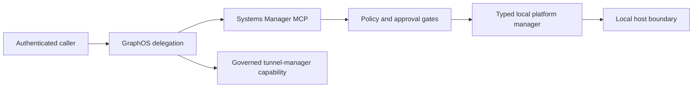

# Systems Manager concept overview

**Ecosystem role:** a typed local-host operations provider for GraphOS and
agent-utilities.

## Capability model

`systems-manager` selects one local platform implementation at runtime:

- `AptManager` for Debian-family systems;
- `DnfManager` for supported RPM-family systems;
- `ZypperManager` for supported SUSE systems;
- `PacmanManager` for Arch systems;
- `WindowsManager` for Windows.

The default MCP session presents the small intent-verb surface and loads current
action-routed domains on demand for system, service, process, network, disk, user,
managed-file, scheduled-task, firewall, toolchain, physical-storage, and Agent OS
operations. Raw command execution is not part of the current API.

## Security boundary

Every privileged class is explicit:

- host mutations require `SYSTEMS_MANAGER_ALLOW_HOST_MUTATIONS=true` and
  request-channel approval;
- managed-file writes also require
  `SYSTEMS_MANAGER_ALLOW_FILESYSTEM_MUTATIONS=true`;
- sensitive inventory requires `SYSTEMS_MANAGER_ALLOW_SENSITIVE_READS=true`;
- active probes require `SYSTEMS_MANAGER_ALLOW_NETWORK_PROBES=true`.

Commands use validated argv, trusted executable resolution, bounded output,
bounded time, and process-tree termination. Files are confined below an explicit
managed root. Firewall changes use `FirewallRuleSpec`; scheduled-command creation,
persistent aliases, raw shell, and model-supplied credentials are unavailable.

Network MCP transports refuse to start without configured authentication, and
non-loopback listeners require a direct or trusted-proxy TLS boundary. Non-loopback
agent listeners require the explicit allow gate, TLS boundary configuration, and JWT
authentication. Certificate trust comes from AgentConfig TLS profiles; private CA
bundles are never embedded.

## Fleet composition

Host operations run where the process runs. GraphOS can delegate to an
authenticated systems-manager instance on each target or compose tunnel-manager's
host-key-verified SSH capabilities. The package does not embed inventory profiles,
connection endpoints, identities, or workstation paths.



## Knowledge-graph integration

`systems_ingest_host` collects the local typed telemetry surface and hands an
allowlisted report to the native governed knowledge-graph ingestion seam. The provider
ships a human-authored ontology, mapping, and source preset; deployment authority,
tenant, ACL, provenance, retention, classification, and any release certification
remain external. Missing authority or engine availability is an explicit failure, not
a best-effort no-op. Raw hostnames, addresses, paths, and identities are excluded, and
stable node references require a deployment-owned pseudonymization key.

## Configuration

Use AgentConfig and the package's reference-only MCP catalog. Endpoints, credential
references, model settings, managed roots, inventory, and TLS-profile catalogs are
deployment inputs.
Run the ecosystem doctor before enabling optional storage, observability, Agent OS,
or ingestion capabilities.

A minimal local stdio entry is:

```json
{
  "mcpServers": {
    "systems-manager": {
      "command": "systems-manager-mcp",
      "args": ["--transport", "stdio"],
      "env": {
        "SYSTEMS_MANAGER_FILESYSTEM_ROOT": "env://SYSTEMS_MANAGER_FILESYSTEM_ROOT",
        "SYSTEMS_MANAGER_PSEUDONYMIZATION_KEY": "env://SYSTEMS_MANAGER_PSEUDONYMIZATION_KEY",
        "TLS_PROFILE": "env://TLS_PROFILE",
        "TLS_PROFILES_REF": "env://TLS_PROFILES_REF",
        "SYSTEMS_MANAGER_ALLOW_HOST_MUTATIONS": "false",
        "SYSTEMS_MANAGER_ALLOW_FILESYSTEM_MUTATIONS": "false",
        "SYSTEMS_MANAGER_ALLOW_SENSITIVE_READS": "false",
        "SYSTEMS_MANAGER_ALLOW_NETWORK_PROBES": "false"
      }
    }
  }
}
```

See [Configuration](configuration.md), [Usage](usage.md), and
[Host lifecycle coverage](host-lifecycle-coverage.md) for the operator contract.
