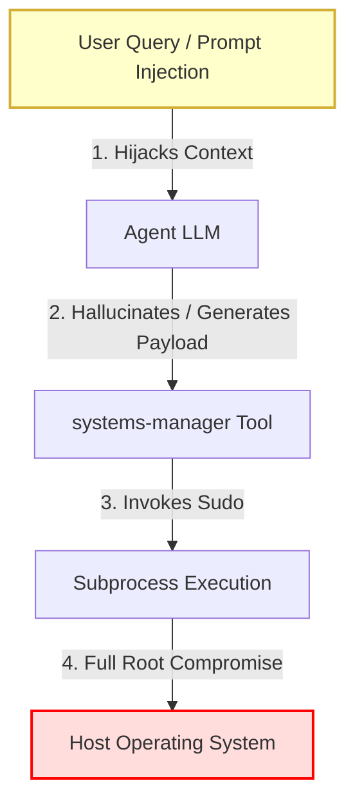
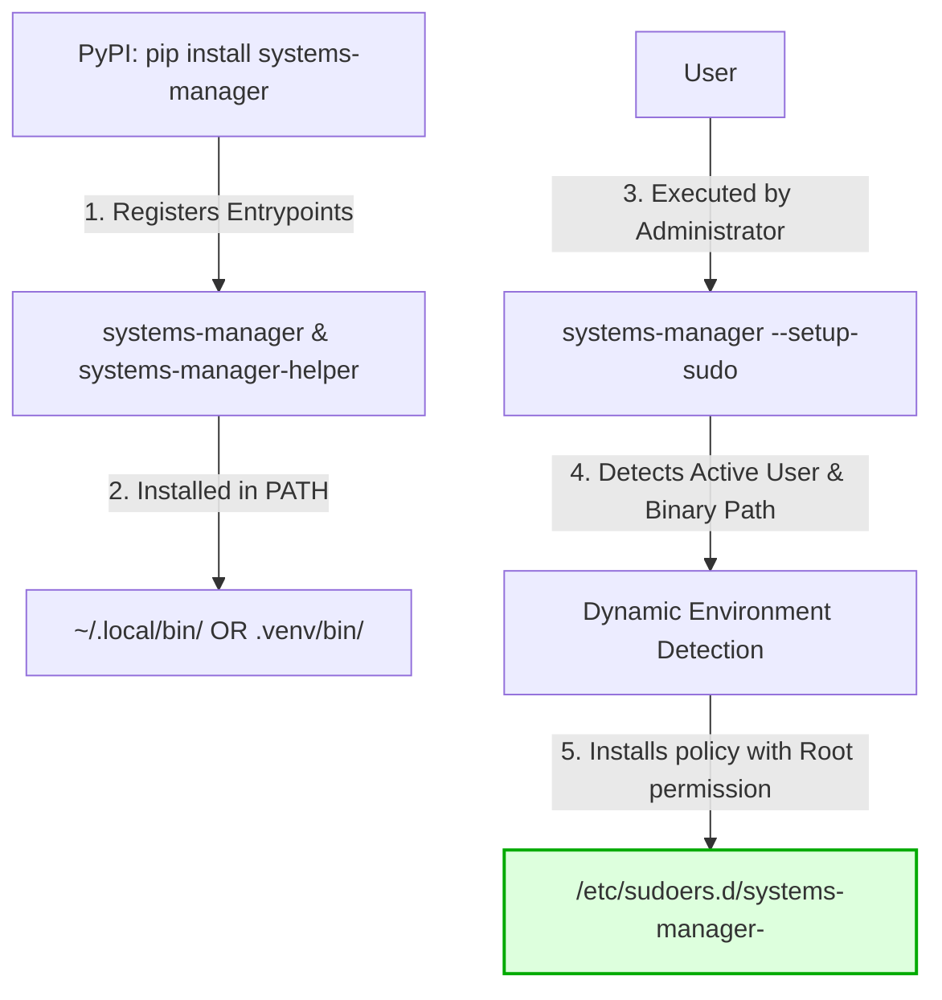
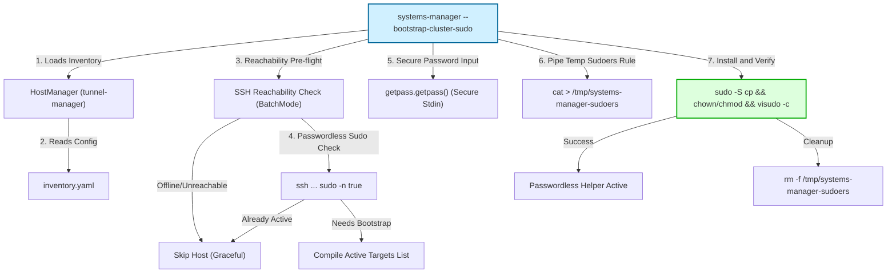

# Secure Sudo Wrapper Architecture & Threat Model

Allowing automated AI agents to execute actions with root privileges (`sudo`) is a high-risk operational vector. Hallucinations, prompt injections, or malicious tool invocations could result in the catastrophic compromise of the host system.

This document outlines the professional, enterprise-safe security architecture implemented in `systems-manager` to enable elevated capabilities for the agent while strictly enforcing the **Principle of Least Privilege (PoLP)**.

---

## 1. Threat Model & Security Risks

When an agent executes shell commands via `sudo`, it creates several attack vectors:

### Key Attack Vectors & Mitigations

| Attack Vector | Description | Mitigation Strategy |
| :--- | :--- | :--- |
| **Prompt Injection** | An attacker injects instructions causing the agent to execute commands like `sudo rm -rf /` or download malicious binaries. | Strict parameter schemas and whitelisting at the system wrapper layer. |
| **Command Chaining / Injection** | Input parameters containing characters like `;`, `&&`, `\|`, or backticks lead to executing unintended secondary commands. | Avoid `shell=True` in Python subprocess calls; perform strict regex and whitelist validation. |
| **Pager Escapes** | Commands like `systemctl status` or `journalctl` default to using a pager (like `less` or `more`). An interactive pager allows shell escape commands (e.g., typing `!/bin/sh` to get a root shell). | Set environment variable `SYSTEMD_PAGER=cat` or use the `--no-pager` flag. |
| **Turing-Complete Interpreter Execution** | Allowing `sudo python3` allows the caller to execute arbitrary code using python's standard libraries. | Never allow passwordless sudo on general-purpose interpreters. Always point to a highly locked-down binary. |

---

## 2. Secure Sudo Wrapper Design (The Gold Standard)

To secure `systems-manager`, we rejected unsafe approaches like blanket passwordless sudo (`ALL=(ALL) NOPASSWD: ALL`) or wildcard-based sudoers lists (`/usr/bin/systemctl start *`). Instead, we implemented a **Secure Sudo Wrapper** (`systems-manager-helper`):

1. **Structured Inputs**: The helper accepts highly structured CLI arguments (`service <action> <name>` or `package <action> [name]`) rather than arbitrary command strings.
2. **Whitelist Restrictions**: The helper enforces a hardcoded, read-only whitelist of allowed service names and package names. Any request to touch a service or package not in this whitelist is rejected immediately.
3. **Execution Safety**: Commands are run with `shell=False`, a strict `PATH` environment, and `SYSTEMD_PAGER=cat` to eliminate command-chaining and pager-escape vulnerabilities.
4. **Structured JSON Output**: All results are returned as standardized JSON objects (`{"success": true, "stdout": "...", "stderr": "..."}`) which are then parsed programmatically by the non-privileged agent space.

### The Security Policy (Whitelist)

The secure wrapper restricts elevated actions to the following pre-approved assets:

* **Whitelisted Services**: `nginx`, `caddy`, `docker`, `ssh`, `fail2ban`, `snapd.socket`, `snapd`.
* **Whitelisted Packages**: `curl`, `git`, `htop`, `rsync`, `ufw`, `trash-cli`, `snapd`, `nginx`, `caddy`, `docker.io`, `fail2ban`.

Any attempt to manipulate other system entities will fail with a security violation.

---

## 3. Package Distribution & Bootstrapping Architecture

Since `pip` or `uv` installations cannot write directly to system files like `/etc/sudoers` or change file ownership to `root`, `systems-manager` includes a self-triggering bootstrapping utility (`--setup-sudo`) that administrators can execute once to install the policy securely:

1. **Entrypoints Registration**: Two console scripts are registered in `pyproject.toml`:
    * `systems-manager`: Standard user CLI.
    * `systems-manager-helper`: The secure root-only helper wrapper.
2. **Dynamic Location Discovery**: When running `--setup-sudo`, the script dynamically determines the absolute path of the `systems-manager-helper` within the active virtual environment or user bin folder.
3. **Visudo Verification**: To prevent configuration syntax errors that could lock administrators out of the system, a temporary configuration file is generated, validated via `visudo -c -f <file>`, and only then copied to `/etc/sudoers.d/systems-manager-<user>` with strict permissions `0440` owned by `root:root`.

---

## 4. Multi-Host Cluster Bootstrapping Architecture

For multi-host topologies, configuring sudoers rules manually on every single node is highly inefficient and error-prone. To solve this, `systems-manager` introduces a cluster-wide automated sudo bootstrapping system triggered via the `--bootstrap-cluster-sudo` flag.

### Key Security & Operational Safeguards

#### A. Host Connection Pre-flight Checks (Anti-Hang Guard)
When running across a cluster, any host that is offline or misconfigured can cause standard SSH connections to hang or interactively prompt for passwords/passphrases. To guarantee non-blocking batch execution, the bootstrap routine:
1. **Explicit Offline Skip**: Skips specific nodes known to be structurally offline in the environment (e.g. `gr1080`).
2. **Fast Connection Test**: Runs a connection test using SSH with `ConnectTimeout=3` and `-o BatchMode=yes` set. This forces SSH to fail instantly and return non-zero if the port is unreachable or key-authentication is not yet ready, avoiding hanging the orchestrator.
3. **Passwordless Check**: Executes `sudo -n true` over SSH to check if passwordless sudo for the `systems-manager-helper` (or generic passwordless execution) is already active. If it is, the host is skipped, avoiding redundant configuration cycles.

#### B. Single-Prompt Credential Piping
For hosts requiring bootstrap, asking the operator to type their password multiple times or storing credentials in plain text are severe security vulnerabilities.
* **Prompt Once**: The utility prompts the operator exactly *once* using `getpass.getpass()`.
* **Zero CLI Leaks**: Sudo passwords are never passed as CLI arguments (which would expose them to the process list e.g. via `ps aux`).
* **Secure Stdin Piping**: The password is piped directly to the remote SSH command stream (`sudo -S -p '' sh -c ...`) using `subprocess.communicate(input=password + "\n")` over a secure socket.

#### C. Isolated Rule Staging and Atomic Visudo Check
Modifying `/etc/sudoers` or `/etc/sudoers.d/*` files directly can lead to system-wide lockouts if syntax errors occur. The multi-host bootstrap workflow employs a strict three-stage atomic transaction:
1. **Write to /tmp**: The NOPASSWD helper rule (`<user> ALL=(ALL) NOPASSWD: /path/to/systems-manager-helper`) is piped safely into a temporary file `/tmp/systems-manager-sudoers` via `cat` over standard SSH.
2. **Privileged Setup & Verification**: The temporary file is copied to `/etc/sudoers.d/systems-manager-<user>`, its ownership is changed to `root:root`, and permissions are set to `0440`.
3. **visudo Verification**: The command executes `visudo -c -f /etc/sudoers.d/systems-manager-<user>` to verify syntax. If visudo fails, the configuration is instantly rolled back (deleted) and the command exits with `1`, ensuring the host's sudo system remains fully functional.
4. **Guaranteed Remote Cleanup**: Under all circumstances (success or failure), a cleanup command `rm -f /tmp/systems-manager-sudoers` is dispatched to prevent leaking temporary configuration files.
