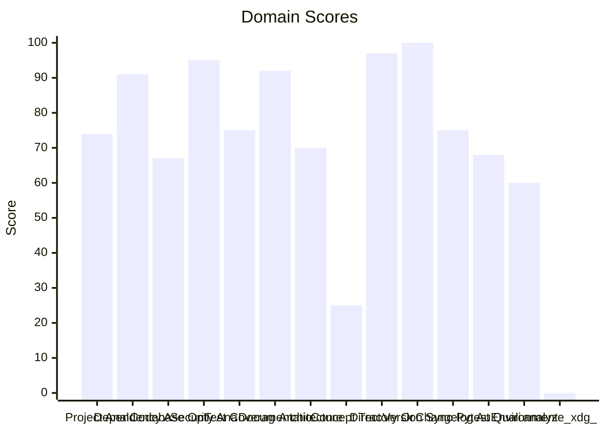

# 🔬 Code Enhancement Report

> **Generated**: 2026-05-22 21:07:11 UTC | **Target**: systems-manager | **Overall GPA**: 2.21/4.0

---

## 📊 Executive Summary

| Domain | Grade | Score | Status |
|--------|-------|-------|--------|
| analyze_xdg_kg | 🔴 F | 0/100 | `░░░░░░░░░░░░░░░░░░░░` 0/100 |
| Concept Traceability | 🔴 F | 25/100 | `█████░░░░░░░░░░░░░░░` 25/100 |
| Environment Variables | 🟠 D | 60/100 | `████████████░░░░░░░░` 60/100 |
| Codebase Optimization | 🟠 D | 67/100 | `█████████████░░░░░░░` 67/100 |
| Pytest Quality | 🟠 D | 68/100 | `█████████████░░░░░░░` 68/100 |
| Architecture & Design Patterns | 🟡 C | 70/100 | `██████████████░░░░░░` 70/100 |
| Project Analysis | 🟡 C | 74/100 | `██████████████░░░░░░` 74/100 |
| Test Coverage | 🟡 C | 75/100 | `███████████████░░░░░` 75/100 |
| Changelog Audit | 🟡 C | 75/100 | `███████████████░░░░░` 75/100 |
| Dependency Audit | 🟢 A | 91/100 | `██████████████████░░` 91/100 |
| Documentation & Governance | 🟢 A | 92/100 | `██████████████████░░` 92/100 |
| Security Analysis | 🟢 A | 95/100 | `███████████████████░` 95/100 |
| Directory Organization | 🟢 A | 97/100 | `███████████████████░` 97/100 |
| Version Sync Analysis | 🟢 A | 100/100 | `████████████████████` 100/100 |

---

## 📋 Domain Scorecards

### Project Analysis — 🟡 Grade: C (74/100)

`██████████████░░░░░░` 74/100

> [!NOTE]
> Detected ecosystem marker: agent-utilities → Agent-Utilities Ecosystem

| Criterion | Points | Evidence | Reasoning |
|-----------|--------|----------|-----------|
| has_pyproject | 10 | `pyproject.toml and requirements.txt` | Both pyproject.toml and requirements.txt exist, fulfilling mandatory Python proj |
| project_type_detected | 10 | `Agent-Utilities Ecosystem` | Identified 1 ecosystem marker(s) in dependencies |
| externalized_prompts | 0 | `/home/apps/workspace/agent-packages/agents/systems-manager` | No prompts/ directory found. Prompts may be hardcoded in source. |
| observability | 0 | `dependency list` | No observability tools (logfire, sentry, opentelemetry) found |
| testing_suite | 10 | `tests dir: True, pytest dep: True` | Tests directory exists, pytest in dependencies |
| agents_md | 10 | `/home/apps/workspace/agent-packages/agents/systems-manager/A` | AGENTS.md exists with comprehensive content |
| pre_commit_hooks | 10 | `/home/apps/workspace/agent-packages/agents/systems-manager/.` | Pre-commit configuration found for automated code quality checks |
| gitignore | 10 | `/home/apps/workspace/agent-packages/agents/systems-manager/.` | .gitignore exists to prevent committing build artifacts and secrets |
| env_template | 10 | `/home/apps/workspace/agent-packages/agents/systems-manager/.` | Environment template exists for onboarding and secret management |
| protocol_support | 4 | `MCP` | 1 communication protocol(s) detected |

**Findings:**
- Protocol support: MCP

---

### Dependency Audit — 🟢 Grade: A (91/100)

`██████████████████░░` 91/100

> [!TIP]
> Minor update: pytest-xdist 3.6.0 (constraint — not installed) -> 3.8.0

| Criterion | Points | Evidence | Reasoning |
|-----------|--------|----------|-----------|
| dependency_freshness | 91 | `source=/home/apps/workspace/agent-packages/agents/systems-ma` | Audited 7 deps (5 installed, 2 constraint-only). 0 major, 3 minor, 0 patch updates |

**Findings:**
- Minor update: agent-utilities 0.2.40 (installed) -> 0.16.0
- Minor update: psutil 7.1.0 (installed) -> 7.2.2

---

### Codebase Optimization — 🟠 Grade: D (67/100)

`█████████████░░░░░░░` 67/100

> [!WARNING]
> 2 functions exceed 200 lines (actionable refactoring targets): get_mcp_instance (398L), register_os_provider_tools (266L)

| Criterion | Points | Evidence | Reasoning |
|-----------|--------|----------|-----------|
| code_quality | 67 | `{"file_count": 24, "total_lines": 7984, "function_count": 34` | Analyzed 24 files, 348 functions. Avg CC=4.4, max length=398, duplication=0.4%,  |

**Findings:**
- Monolithic: systems_manager.py (2898L) — 9 functions with high complexity (worst: systems_manager at 140L, CC=21); Low cohesion: 16 distinct concepts in one file
- Needs attention: agent_os_tools.py (735L) — Low cohesion: 14 distinct concepts in one file
- 19 functions with nesting depth >4

---

### Security Analysis — 🟢 Grade: A (95/100)

`███████████████████░` 95/100

| Criterion | Points | Evidence | Reasoning |
|-----------|--------|----------|-----------|
| security_posture | 95 | `high=0 med=0 low=0 attack_surface={"subprocess_calls": 50, "` | Scanned 24 files. Found 0 security findings. High: -0pts, Med: -0pts, Low: -0pts |

---

### Test Coverage — 🟡 Grade: C (75/100)

`███████████████░░░░░` 75/100

> [!NOTE]
> Test suite lacks intent diversity (only one type)

| Criterion | Points | Evidence | Reasoning |
|-----------|--------|----------|-----------|
| test_coverage_quality | 75 | `{"test_file_count": 9, "test_count": 85, "source_file_count"` | 85 tests across 9 files. Ratio: 3.54. Intent: {'unit': 85}. 1 without assertions |

**Findings:**
- 12 potential doc-test drift items

---

### Documentation & Governance — 🟢 Grade: A (92/100)

`██████████████████░░` 92/100

> [!TIP]
> README.md missing sections: usage|quick start

| Criterion | Points | Evidence | Reasoning |
|-----------|--------|----------|-----------|
| documentation_quality | 92 | `{"README.md": {"exists": true, "missing": ["usage|quick star` | Audited 6 standard docs + docs/ directory. 0 broken references, 4 docs present.  |

**Findings:**
- 2 broken internal links in README.md
- README missing: Has a Table of Contents
- README missing: Has usage examples with code blocks

---

### Architecture & Design Patterns — 🟡 Grade: C (70/100)

`██████████████░░░░░░` 70/100

> [!NOTE]
> SRP: 4 modules exceed 500 lines (god modules)

| Criterion | Points | Evidence | Reasoning |
|-----------|--------|----------|-----------|
| architecture_quality | 70 | `{"layers": 0, "di_ratio": 0.25, "solid_violations": 2}` | Analyzed 24 files. 0/5 architecture layers present, DI ratio: 25%, 2 SOLID viola |

**Findings:**
- SRP: 2 classes have >15 methods
- No discernible layer architecture (no domain/service/adapter separation)

---

### Concept Traceability — 🔴 Grade: F (25/100)

`█████░░░░░░░░░░░░░░░` 25/100

> [!CAUTION]
> Low traceability ratio: 0% concepts fully traced

| Criterion | Points | Evidence | Reasoning |
|-----------|--------|----------|-----------|
| concept_traceability | 25 | `{"total_concepts": 8, "well_traced": 0, "orphans": 8, "drift` | 8 unique concepts found. 0 fully traced (code+docs+tests), 8 orphans, 0 drifted. |

**Findings:**
- 8 orphaned concepts (only in one source)
- 85 test functions missing concept markers
- 146 significant functions (>10 lines) missing concept markers in docstrings

---

### Directory Organization — 🟢 Grade: A (97/100)

`███████████████████░` 97/100

> [!TIP]
> 1 rogue/throwaway scripts detected (fix_*, validate_*, patch_*, etc.): scripts/validate_a2a_agent.py

| Criterion | Points | Evidence | Reasoning |
|-----------|--------|----------|-----------|
| directory_organization | 97 | `{"total_source_files": 53, "total_directories": 9, "max_dept` | 53 files across 9 directories. Max depth: 3, avg files/dir: 5.9. 0 crowded, 0 se |

---

### Version Sync Analysis — 🟢 Grade: A (100/100)

`████████████████████` 100/100

> [!TIP]
> All version '1.15.0' declarations appear to be tracked correctly.

| Criterion | Points | Evidence | Reasoning |
|-----------|--------|----------|-----------|
| bumpversion_exists | 20 | `/home/apps/workspace/agent-packages/agents/systems-manager/.` | .bumpversion.cfg found |
| current_version_defined | 20 | `1.15.0` | Current version tracked is 1.15.0 |
| files_tracked | 20 | `6 files tracked` | Found 6 files tracked in .bumpversion.cfg |
| version_drift_check | 40 | `0 drifted files` | No version drift detected in codebase files |

---

### Changelog Audit — 🟡 Grade: C (75/100)

`███████████████░░░░░` 75/100

> [!NOTE]
> CHANGELOG.md is missing — create one following Keep a Changelog format

| Criterion | Points | Evidence | Reasoning |
|-----------|--------|----------|-----------|
| changelog_quality | 75 | `{"exists": false, "parseable": false, "version_count": 0, "h` | CHANGELOG.md missing. 0 versions tracked. 0 dependency changelogs analyzed. |

**Findings:**
- CHANGELOG.md is missing

---

### Pytest Quality — 🟠 Grade: D (68/100)

`█████████████░░░░░░░` 68/100

> [!WARNING]
> 2 test files exceed 500 lines — split into focused modules

| Criterion | Points | Evidence | Reasoning |
|-----------|--------|----------|-----------|
| pytest_quality | 68 | `{"test_files": 9, "total_tests": 85, "descriptive_name_ratio` | 85 tests across 9 files. Naming: 20/20, Structure: 11/20, Fixtures: 12/20, Asserts |

**Findings:**
- Test directory lacks subdirectory organization (consider unit/, integration/, e2e/)
- Low fixture usage: only 16% of tests use fixtures
- 1 tests have no assertions
- 24 tests use weak assertions (assert result is not None, assert True, etc.)

---

### Environment Variables — 🟠 Grade: D (60/100)

`████████████░░░░░░░░` 60/100

> [!WARNING]
> Only 29% of env vars documented in README.md

| Criterion | Points | Evidence | Reasoning |
|-----------|--------|----------|-----------|
| env_var_documentation | 60 | `{"total_vars": 21, "python_vars": 9, "dockerfile_vars": 4, "` | Found 21 unique env vars across 38 occurrences. README documents 6/21. Has .env. |

**Findings:**
- Undocumented env vars: AGENT_POLICIES_PATH, AUTH_TYPE, EUNOMIA_POLICY_FILE, EUNOMIA_TYPE, MAINTENANCE_PRIORITY, MAINTENANCE_TOKEN_BUDGET, MAX_CONCURRENT_AGENTS, MCP_CONFIG_PATH, OTEL_EXPORTER_OTLP_ENDPOINT, OTEL_EXPORTER_OTLP_PROTOCOL
- 8 Python env vars not in .env.example: AGENT_POLICIES_PATH, MAINTENANCE_PRIORITY, MAINTENANCE_TOKEN_BUDGET, MAX_CONCURRENT_AGENTS, MCP_CONFIG_PATH

---

### analyze_xdg_kg — 🔴 Grade: F (0/100)

`░░░░░░░░░░░░░░░░░░░░` 0/100

> [!CAUTION]
> Analysis error: No module named 'agent_utilities.knowledge_graph'

---

## 🎯 Prioritized Action Items

| # | Priority | Domain | Action | Impact | Risk |
|---|----------|--------|--------|--------|------|
| 1 | 🔴 High | Concept Traceability | Low traceability ratio: 0% concepts fully traced | High | High |
| 2 | 🔴 High | Concept Traceability | 8 orphaned concepts (only in one source) | High | High |
| 3 | 🔴 High | Concept Traceability | 85 test functions missing concept markers | High | High |
| 4 | 🔴 High | Concept Traceability | 146 significant functions (>10 lines) missing concept markers in docstrings | High | High |
| 5 | 🔴 High | analyze_xdg_kg | Analysis error: No module named 'agent_utilities.knowledge_graph' | High | High |
| 6 | 🔴 High | Codebase Optimization | 2 functions exceed 200 lines (actionable refactoring targets): get_mcp_instance  | High | Medium |
| 7 | 🔴 High | Codebase Optimization | Monolithic: systems_manager.py (2898L) — 9 functions with high complexity (worst | High | Medium |
| 8 | 🔴 High | Codebase Optimization | Needs attention: agent_os_tools.py (735L) — Low cohesion: 14 distinct concepts i | High | Medium |
| 9 | 🔴 High | Codebase Optimization | 19 functions with nesting depth >4 | High | Medium |
| 10 | 🔴 High | Pytest Quality | 2 test files exceed 500 lines — split into focused modules | High | Medium |
| 11 | 🔴 High | Pytest Quality | Test directory lacks subdirectory organization (consider unit/, integration/, e2 | High | Medium |
| 12 | 🔴 High | Pytest Quality | Low fixture usage: only 16% of tests use fixtures | High | Medium |
| 13 | 🔴 High | Pytest Quality | 1 tests have no assertions | High | Medium |
| 14 | 🔴 High | Pytest Quality | 24 tests use weak assertions (assert result is not None, assert True, etc.) | High | Medium |
| 15 | 🔴 High | Pytest Quality | 34 tests have >5 assertions — consider splitting (single responsibility) | High | Medium |
| 16 | 🔴 High | Pytest Quality | 5 tests have excessive mocking (>5 mocks) — test behavior, not implementation | High | Medium |
| 17 | 🔴 High | Environment Variables | Only 29% of env vars documented in README.md | High | Medium |
| 18 | 🔴 High | Environment Variables | Undocumented env vars: AGENT_POLICIES_PATH, AUTH_TYPE, EUNOMIA_POLICY_FILE, EUNO | High | Medium |
| 19 | 🔴 High | Environment Variables | 8 Python env vars not in .env.example: AGENT_POLICIES_PATH, MAINTENANCE_PRIORITY | High | Medium |
| 20 | 🟡 Medium | Project Analysis | Detected ecosystem marker: agent-utilities → Agent-Utilities Ecosystem | Medium | Low |
| 21 | 🟡 Medium | Project Analysis | Protocol support: MCP | Medium | Low |
| 22 | 🟡 Medium | Test Coverage | Test suite lacks intent diversity (only one type) | Medium | Low |
| 23 | 🟡 Medium | Test Coverage | 12 potential doc-test drift items | Medium | Low |
| 24 | 🟡 Medium | Architecture & Design Patterns | SRP: 4 modules exceed 500 lines (god modules) | Medium | Low |
| 25 | 🟡 Medium | Architecture & Design Patterns | SRP: 2 classes have >15 methods | Medium | Low |
| 26 | 🟡 Medium | Architecture & Design Patterns | No discernible layer architecture (no domain/service/adapter separation) | Medium | Low |
| 27 | 🟡 Medium | Changelog Audit | CHANGELOG.md is missing — create one following Keep a Changelog format | Medium | Low |
| 28 | 🟡 Medium | Changelog Audit | CHANGELOG.md is missing | Medium | Low |
| 29 | 🟢 Low | Dependency Audit | Minor update: pytest-xdist 3.6.0 (constraint — not installed) -> 3.8.0 | Low | Low |
| 30 | 🟢 Low | Dependency Audit | Minor update: agent-utilities 0.2.40 (installed) -> 0.16.0 | Low | Low |

---

## 🔄 SDD Handoff

Run `generate_sdd_handoff.py` with this report's JSON data to produce
structured TODO items compatible with the `spec-generator` → `task-planner` →
`sdd-implementer` pipeline. Output will be saved to `.specify/specs/`.
